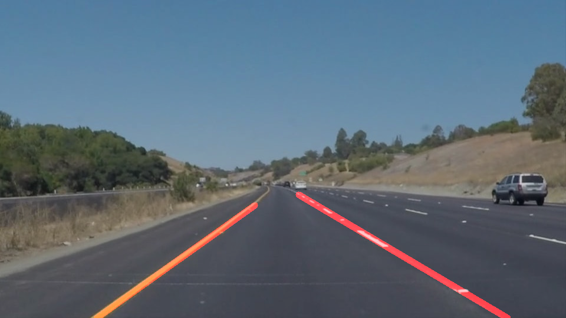

# **Finding Lane Lines on the Road** 

## Writeup by Hannes Bergler

---

**Finding Lane Lines on the Road**

The goals / steps of this project are the following:
* Make a pipeline that finds lane lines on the road
* Reflect on your work in a written report
---

Please find the example output of my pipeline in the following subfolders:
* videos: _/test_videos_output_
* images: _/test_images_output_

The source code is included in the Jupyter Notebook file:
* _P1.ipynb_

---

### Reflection

### 1. Description of my pipeline

I use the same pipeline for finding lane lines in both image and video. The pipeline is implemented by the function _draw_lane_lines_on_image()_ which takes a single image as input. This function uses some of the helper functions that were provided and additionally the two functions _filter_colors()_ and _calc_slope()_ which I implemented myself.

My pipeline consists of the following 9 steps:

1. Filter the colors of the image so that only white and yellow pixels will be left in the image.
2. Convert the resulting image to grayscale.
3. Run Gaussian smoothing / blurring on the image.
4. Run Canny edge detection.
5. Mask the image with polygon to include only the region of the image where the lane lines are expected.
6. Apply Hough transform to identify lines in the image.
7. Separate the detected lines by their slope and their position in the image to assign the lines to the left or right lane line.
8. Average the lines using linear regression separately on the left and the right lines. Then extrapolate the resulting two lines by putting the lower line end to the bottom of the image and the upper end in between the uppermost line segment that was detected and the upper side of the polygon that was defined to mask the image. For me this is a good compromise between extrapolating too much or too little.
9. Finally the two detected, averaged and extrapolated lane lines are drawn on the original image.

In order to draw a single line on the left and right lanes, I did NOT modify the draw_lines() function. I implemented all necessary steps in my _draw_lane_lines_on_image()_-function.

Here is an image which I used for testing my pipeline, followed by the same image with the detected lane lines in red: 

### 2. Potential shortcomings with my current pipeline

In my opinion, the biggest shortcoming of the current pipeline is that it can only detect lane lines correctly when our car which takes the images/videos is driving in the middle of and parallel to a lane. Furthermore, only the lane lines of the current lane are detected, not the lines of the other lanes that might be there.

Another potential shortcoming could be what would happen when a (especially) white or yellow car would cross lanes directly in front of our future self-driving car. That would certainly lead to incorrectly detected lane lines.

Other problems might occour with highway exits and accesses, crossroads, sharp turns, changing lighting conditions and many more unexpected situations...

### 3. Suggestion of possible improvements to my pipeline

A very important improvement would be to make the pipine tolerant to lane changes of both our self-driving car and of other cars right in front of our car.

The next step could be to combine lane detection with detection of other vehicels and objects in general. So that objects like cars, people or street signs will not be taken for lane lines.
